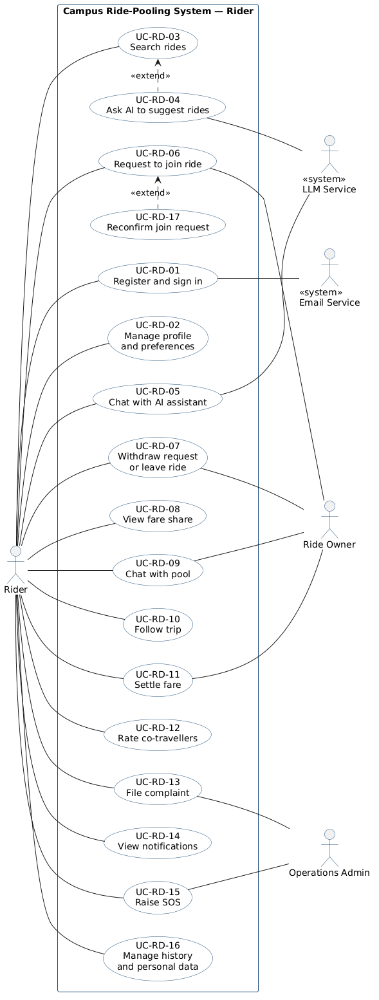
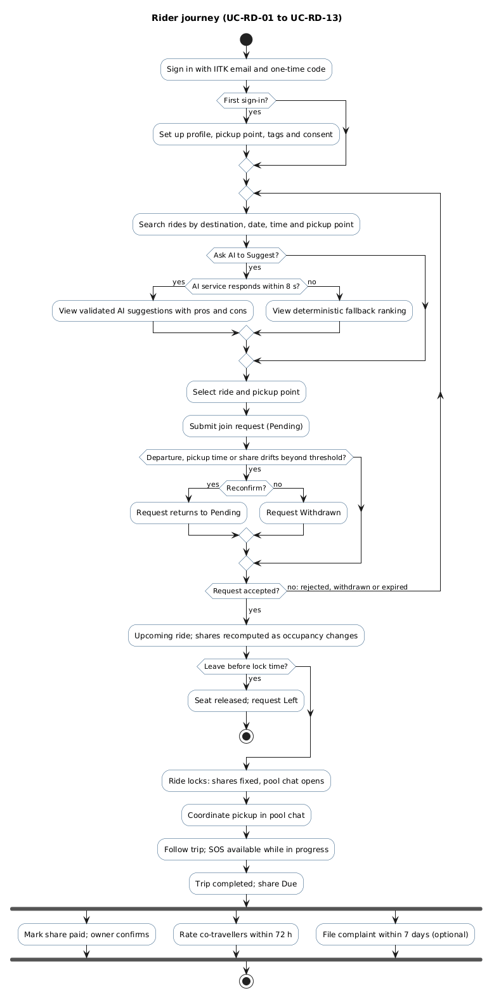
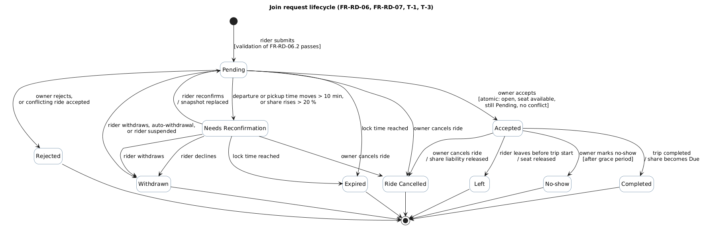

# Rider — Use Cases

## Use-case diagram

Source: `diagrams/rider_use_case.puml`. UC-RD-04 extends *Search rides* (AI suggestions are an
optional behaviour of a search); UC-RD-17 extends *Request to join ride* (reconfirmation happens only
when a pending request drifts).

## Supporting behavioural models

**Rider journey** — activity diagram of the normal path through the use cases:

**Join request lifecycle** — state diagram of every request state and transition used in
`02_functional_requirements.md` (FR-RD-06, FR-RD-07, Tables T-1 and T-3):

## Use-case descriptions

Each description follows the tabular form: actors, description, data, stimulus, response and
comments. The critical use cases (UC-RD-03, 04, 06, 07, 17) also give preconditions, flows and
postconditions.

### UC-RD-01 — Register and sign in

| | |
|---|---|
| **Actors** | Rider; «system» Email Service |
| **Description** | A student registers with an IIT Kanpur email address and signs in with a one-time code sent to that address. A suspended or warned rider is informed of the account's status. |
| **Data** | Email address, one-time code, session |
| **Stimulus** | Rider enters an email address on the sign-in screen |
| **Response** | One-time code emailed; on the correct code, a session starts; for a first sign-in, profile setup begins (UC-RD-02) |
| **Comments** | Only `iitk.ac.in` addresses are accepted. Suspension blocks new transactional actions but not SOS, history, complaints or settling shares already due. |
| **Related requirements** | FR-RD-01.1, FR-RD-01.2, FR-RD-01.3, FR-RD-01.4, FR-RD-01.5, FR-RD-01.6 |

### UC-RD-02 — Manage profile and preferences

| | |
|---|---|
| **Actors** | Rider |
| **Description** | The rider sets and edits a display name, default pickup point, interest tags, visibility of tags, default ride preferences and blocked users. |
| **Data** | Display name, pickup point, tags, visibility settings, preferences, consent for AI use of tags, blocked users, optional mobile number |
| **Stimulus** | First sign-in, or rider opens the profile screen |
| **Response** | Profile saved; changes apply to later searches and suggestions |
| **Comments** | Tags come only from the administrator-maintained list. Email and mobile number are never visible to other users; the mobile number is visible only to administrators, for SOS response. |
| **Related requirements** | FR-RD-02.1, FR-RD-02.2, FR-RD-02.3, FR-RD-02.4, FR-RD-02.5, FR-RD-02.6, FR-RD-02.7 |

### UC-RD-03 — Search rides *(critical)*

| | |
|---|---|
| **Actors** | Rider |
| **Description** | The rider finds open rides to a destination on a date, from a chosen pickup point, and sees live seat availability and an estimated share for each. |
| **Data** | Destination, date, time window, pickup point, vehicle type; results with seats, times, fare, estimated share, owner rating, shared tags |
| **Stimulus** | Rider submits search filters |
| **Response** | A list of open rides with at least one seat, or on which the rider already has a request, updated live while displayed |
| **Preconditions** | Rider signed in with a completed profile |
| **Main flow** | 1. Rider enters destination and date, optionally a time window, pickup point and vehicle type. 2. System returns matching open rides with the fields of FR-RD-03.3. 3. Rider sorts or opens a ride's details. 4. While results are shown, seat, time and state changes are pushed to the display. |
| **Alternative flows** | 2a. No rides match: system shows the nearest rides outside the window (FR-RD-03.7). 4a. A displayed ride fills, locks or is cancelled: its join action is disabled within 2 s. 3a. Rider asks for AI suggestions (UC-RD-04). |
| **Postconditions** | Displayed availability is never older than the real-time update target |
| **Comments** | Addresses the proposal's stale-availability concern at the point of display; allocation itself is protected in UC-RD-06. |
| **Related requirements** | FR-RD-03.1, FR-RD-03.2, FR-RD-03.3, FR-RD-03.4, FR-RD-03.5, FR-RD-03.6, FR-RD-03.7 |

### UC-RD-04 — Ask AI to suggest rides *(critical)*

| | |
|---|---|
| **Actors** | Rider; «system» LLM Service |
| **Description** | For the current search, the AI agent ranks up to 5 open rides and explains each with pros and cons. |
| **Data** | Search criteria; rider's consented tags; candidate rides with computed shares, pickup times and shared tags; ranked suggestions |
| **Stimulus** | Rider selects "Ask AI to Suggest" |
| **Response** | Validated, ranked suggestions labelled as AI-generated, or a labelled deterministic fallback |
| **Preconditions** | A valid search with at least one candidate ride |
| **Main flow** | 1. System gathers candidate rides and computes each one's share, pickup time and shared tags. 2. System sends only permitted fields to the LLM Service. 3. LLM Service returns a ranking with pros and cons. 4. System validates every ride and every stated figure. 5. System displays up to 5 suggestions with their factors. |
| **Alternative flows** | 3a. Error or no response within 8 s: system shows the deterministic ranking. 4a. A suggested ride is missing, closed or full: it is removed; if no suggestion remains, the deterministic ranking is shown. 4b. A stated figure is wrong: the explanation is replaced by a factual summary. 5a. Rider marks a suggestion helpful or not, or reports it. |
| **Postconditions** | Every displayed suggestion refers to an open ride with a seat; an audit record exists |
| **Comments** | Advisory only: joining still requires UC-RD-06. Other users' display names reach the model as data only. |
| **Related requirements** | FR-RD-04.1, FR-RD-04.2, FR-RD-04.3, FR-RD-04.4, FR-RD-04.5, FR-RD-04.6, FR-RD-04.7, FR-RD-04.8, AI-RD-01, AI-RD-02, AI-RD-03, AI-RD-05, AI-RD-06, AI-RD-07, AI-RD-08, AI-RD-09, AI-RD-10, AI-RD-11, AI-RD-12, AI-RD-13, AI-RD-14, AI-RD-15 |

### UC-RD-05 — Chat with AI assistant

| | |
|---|---|
| **Actors** | Rider; «system» LLM Service |
| **Description** | The rider asks questions in natural language to filter rides, learn about owners and co-riders, or change preferences. |
| **Data** | Rider's message; interpreted filters; public profile fields; proposed preference changes |
| **Stimulus** | Rider sends a chatbot message |
| **Response** | Matching rides with editable interpreted filters, public profile information, or a proposed change awaiting confirmation |
| **Comments** | The chatbot cannot join, leave, pay, rate, complain, message the pool or raise SOS; it links to the relevant screen instead. Conversation content lasts only while the browser tab stays open. |
| **Related requirements** | FR-RD-05.1, FR-RD-05.2, FR-RD-05.3, FR-RD-05.4, FR-RD-05.5, FR-RD-05.6, FR-RD-05.7, AI-RD-01, AI-RD-02, AI-RD-03, AI-RD-04, AI-RD-05, AI-RD-07, AI-RD-08, AI-RD-09, AI-RD-10, AI-RD-12, AI-RD-13, AI-RD-14, AI-RD-15 |

### UC-RD-06 — Request to join ride *(critical)*

| | |
|---|---|
| **Actors** | Rider; Ride Owner |
| **Description** | The rider requests one seat on an open ride from a chosen pickup point; the owner accepts or rejects it. |
| **Data** | Ride, pickup point, idempotency key; snapshot of departure time, pickup time and estimated share; request state and history |
| **Stimulus** | Rider submits a join request from the ride details view |
| **Response** | Request created as Pending and the owner notified; later Accepted, Rejected, Expired or Ride Cancelled, with the rider notified; an accepted seat becomes Ride Cancelled, with no fare liability, if the owner cancels the ride |
| **Preconditions** | Rider signed in, not suspended, with fewer than 3 active requests |
| **Main flow** | 1. Rider selects a pickup point and submits. 2. System validates the conditions of FR-RD-06.2 and stores a Pending request with a snapshot. 3. Owner is notified. 4. Owner accepts. 5. System, atomically, re-checks seat availability, request state and conflicts, marks the request Accepted and reduces available seats. 6. System withdraws the rider's conflicting active requests and notifies the rider. |
| **Alternative flows** | 2a. A condition fails: submission rejected with the reason. 2b. Repeated submission with the same key: the existing request is returned. 4a. Owner rejects: request Rejected. 5a. No seat left: no effect; request stays Pending. 5b. Rider accepted elsewhere concurrently: request Rejected (conflict). *Any time before acceptance:* drift beyond threshold → UC-RD-17; lock time → Expired; ride cancelled → Ride Cancelled. |
| **Postconditions** | Accepted occupants never exceed the vehicle's capacity; the rider holds at most one accepted seat per conflict window |
| **Comments** | The core transactional workflow and the shared contended resource (vehicle seats). |
| **Related requirements** | FR-RD-06.1, FR-RD-06.2, FR-RD-06.3, FR-RD-06.4, FR-RD-06.7, FR-RD-06.8, FR-RD-06.9, FR-RD-06.10, FR-RD-06.11 |

### UC-RD-17 — Reconfirm join request *(critical; extends UC-RD-06)*

| | |
|---|---|
| **Actors** | Rider |
| **Description** | When a pending request's departure time, pickup time or estimated share drifts beyond threshold, the rider confirms or declines the new terms before the owner may accept. |
| **Data** | Old and new departure time, pickup time and share |
| **Stimulus** | System detects drift and sets the request to Needs Reconfirmation |
| **Response** | Rider sees old and new values; on reconfirm the request returns to Pending with a new snapshot; on decline it is Withdrawn |
| **Preconditions** | Request in Needs Reconfirmation; ride open and before lock time |
| **Main flow** | 1. Another occupant's acceptance, or an owner change, moves the rider's terms beyond the thresholds of P-09 or P-10. 2. System sets Needs Reconfirmation and notifies the rider with old and new values. 3. Rider reconfirms. 4. System stores the new snapshot and returns the request to Pending, keeping its original submission time. |
| **Alternative flows** | 3a. Rider declines: request Withdrawn, owner notified. 3b. Lock time reached first: request Expired. |
| **Postconditions** | No rider is accepted on terms materially different from those they last agreed to |
| **Comments** | Addresses the proposal's itinerary-drift concern. |
| **Related requirements** | FR-RD-06.5, FR-RD-06.6 |

### UC-RD-07 — Withdraw request or leave ride *(critical)*

| | |
|---|---|
| **Actors** | Rider; Ride Owner |
| **Description** | The rider withdraws an active request or leaves an accepted ride; the seat and fare consequences depend on timing. |
| **Data** | Request, lock time, trip state, shares |
| **Stimulus** | Rider chooses Withdraw or Leave |
| **Response** | Request Withdrawn or Left; seat released; shares recomputed or liability recorded; owner and occupants notified |
| **Preconditions** | An active request, or an accepted request whose trip is still Scheduled (not started) |
| **Main flow** | 1. Rider leaves an accepted ride before lock time. 2. System, atomically, marks the request Left and increases available seats by one. 3. System recomputes remaining occupants' shares and notifies them. 4. The freed seat appears to searching riders within 2 s. |
| **Alternative flows** | 1a. Request still active: it becomes Withdrawn and the owner is notified. 1b. After lock time: confirmation required; late cancellation recorded and locked share remains payable, unless the departure or pickup time changed by more than 10 minutes, or a departure change created a conflict with another accepted ride. 1c. Trip in Pickup in Progress or later: leaving not allowed; SOS remains available. |
| **Postconditions** | Seat count equals capacity minus occupants; shares still sum to the total fare |
| **Related requirements** | FR-RD-07.1, FR-RD-07.2, FR-RD-07.3, FR-RD-07.4, FR-RD-07.5, FR-RD-07.6 |

### UC-RD-08 — View fare share

| | |
|---|---|
| **Actors** | Rider |
| **Description** | The rider sees an estimated share before requesting, a live share while occupancy changes, and the fixed share after lock time, with a breakdown. |
| **Data** | Total fare, fare band, occupants, shares |
| **Stimulus** | Rider opens a ride, or occupancy changes |
| **Response** | Share and breakdown displayed; notification when an accepted rider's share changes |
| **Comments** | Shares are whole rupees summing exactly to the total fare (Table T-2). |
| **Related requirements** | FR-RD-08.1, FR-RD-08.2, FR-RD-08.3, FR-RD-08.4, FR-RD-08.5, FR-RD-08.6 |

### UC-RD-09 — Chat with pool

| | |
|---|---|
| **Actors** | Rider; Ride Owner |
| **Description** | After lock time, the pool's members coordinate the exact meeting place and time through a private chat. |
| **Data** | Text messages, pool membership |
| **Stimulus** | Ride locks; rider sends a message |
| **Response** | Message delivered to connected members within 1 s and stored for offline members |
| **Comments** | Members only; read-only 24 h after completion or cancellation; deleted after 30 days unless a complaint references it. |
| **Related requirements** | FR-RD-09.1, FR-RD-09.2, FR-RD-09.3, FR-RD-09.4, FR-RD-09.5, FR-RD-09.6, FR-RD-09.7 |

### UC-RD-10 — Follow trip

| | |
|---|---|
| **Actors** | Rider; Ride Owner |
| **Description** | The rider follows the trip's state, the pickup order and their own pickup time, and may check in at the pickup point. |
| **Data** | Trip state, pickup order, pickup points, pickup times |
| **Stimulus** | Owner changes the trip state, or the itinerary changes |
| **Response** | Updated trip view; notification of state changes and no-show records |
| **Related requirements** | FR-RD-10.1, FR-RD-10.2, FR-RD-10.3, FR-RD-10.4 |

### UC-RD-11 — Settle fare

| | |
|---|---|
| **Actors** | Rider; Ride Owner |
| **Description** | After the trip, the rider pays the owner outside the platform and records it; the owner confirms or disputes. |
| **Data** | Share, payment method, reference, settlement state |
| **Stimulus** | Trip completed |
| **Response** | Share Due → Marked Paid → Confirmed, or Disputed with a payment complaint opened |
| **Comments** | No money passes through the platform. |
| **Related requirements** | FR-RD-11.1, FR-RD-11.2, FR-RD-11.3, FR-RD-11.4, FR-RD-11.5, FR-RD-11.6 |

### UC-RD-12 — Rate co-travellers

| | |
|---|---|
| **Actors** | Rider |
| **Description** | Within 72 hours of completion, the rider rates the owner and each co-rider from 1 to 5. |
| **Data** | Trip, ratee, score |
| **Stimulus** | Trip completed |
| **Response** | Rating stored; averages updated and shown only once at least 3 ratings exist |
| **Comments** | Low ratings offer the complaint flow. |
| **Related requirements** | FR-RD-12.1, FR-RD-12.2, FR-RD-12.3, FR-RD-12.4 |

### UC-RD-13 — File complaint

| | |
|---|---|
| **Actors** | Rider; Operations Admin |
| **Description** | The rider reports misconduct by an owner or co-rider of a trip, confidentially, and follows its status. |
| **Data** | Trip, accused person, category, description, message references, status |
| **Stimulus** | Rider opens the complaint form, or reports a message or low rating |
| **Response** | Complaint reference issued; complaint forwarded to complaint management; status visible to the rider |
| **Comments** | The complainant's identity and text are never shown to the accused. Safety complaints surface emergency contacts. |
| **Related requirements** | FR-RD-13.1, FR-RD-13.2, FR-RD-13.3, FR-RD-13.4, FR-RD-13.5, FR-RD-13.6 |

### UC-RD-14 — View notifications

| | |
|---|---|
| **Actors** | Rider; «system» Email Service |
| **Description** | The rider receives real-time notifications of events affecting their rides and reviews them in a notification centre. |
| **Data** | Notification type, content, time, read state |
| **Stimulus** | A notifiable event occurs |
| **Response** | In-app notification; email for critical events when the rider is offline |
| **Related requirements** | FR-RD-14.1, FR-RD-14.2, FR-RD-14.3, FR-RD-14.4 |

### UC-RD-15 — Raise SOS

| | |
|---|---|
| **Actors** | Rider; Operations Admin |
| **Description** | During a trip, the rider raises an SOS; administrators receive an incident with the trip's context. |
| **Data** | Rider, ride, trip, occupants, vehicle, pickup points, time, optional mobile number, optional coordinates |
| **Stimulus** | Rider confirms the SOS action |
| **Response** | Incident visible to administrators within 5 s; emergency numbers shown to the rider |
| **Comments** | Not shown to other pool members. The platform does not dispatch emergency services, and says so. |
| **Related requirements** | FR-RD-15.1, FR-RD-15.2, FR-RD-15.3, FR-RD-15.4, FR-RD-15.5, FR-RD-02.7 |

### UC-RD-16 — Manage history and personal data

| | |
|---|---|
| **Actors** | Rider |
| **Description** | The rider reviews past rides, controls consent for AI use of their tags, and can request data export or account deletion. |
| **Data** | Past rides, shares, settlement states, ratings given, consent, deletion request |
| **Stimulus** | Rider opens history or privacy settings |
| **Response** | History shown; consent change applied immediately; deletion completed within 30 days |
| **Related requirements** | FR-RD-16.1, FR-RD-16.2, FR-RD-16.3, FR-RD-16.4 |
