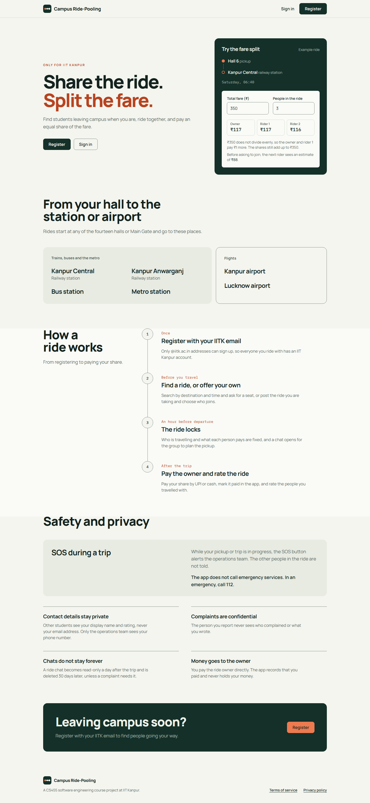
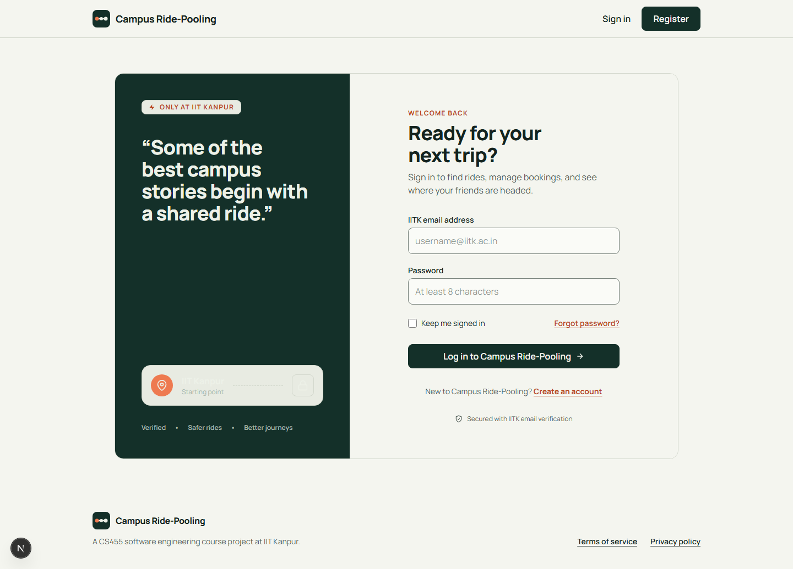
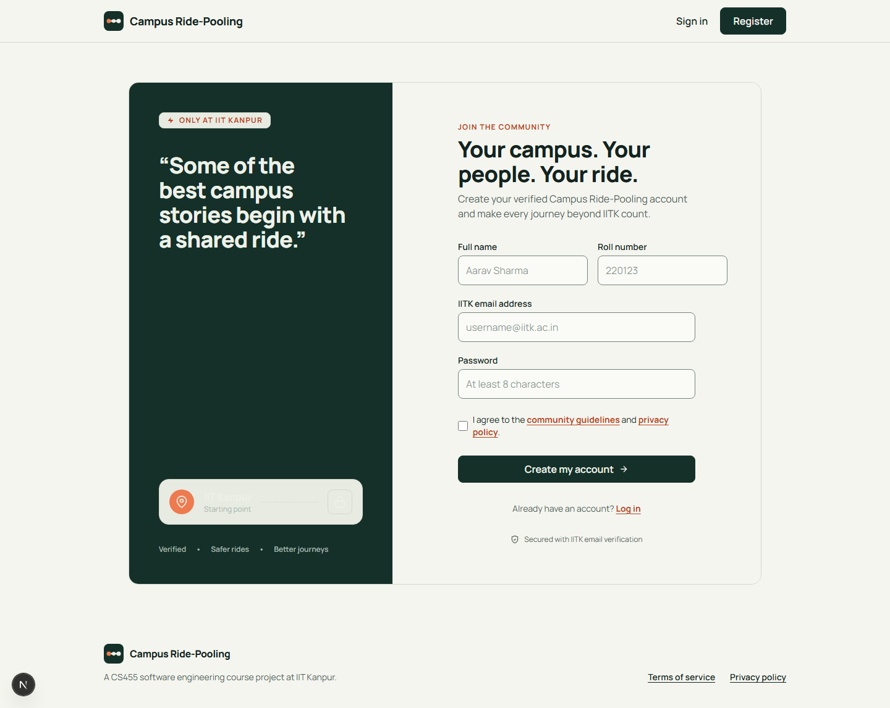
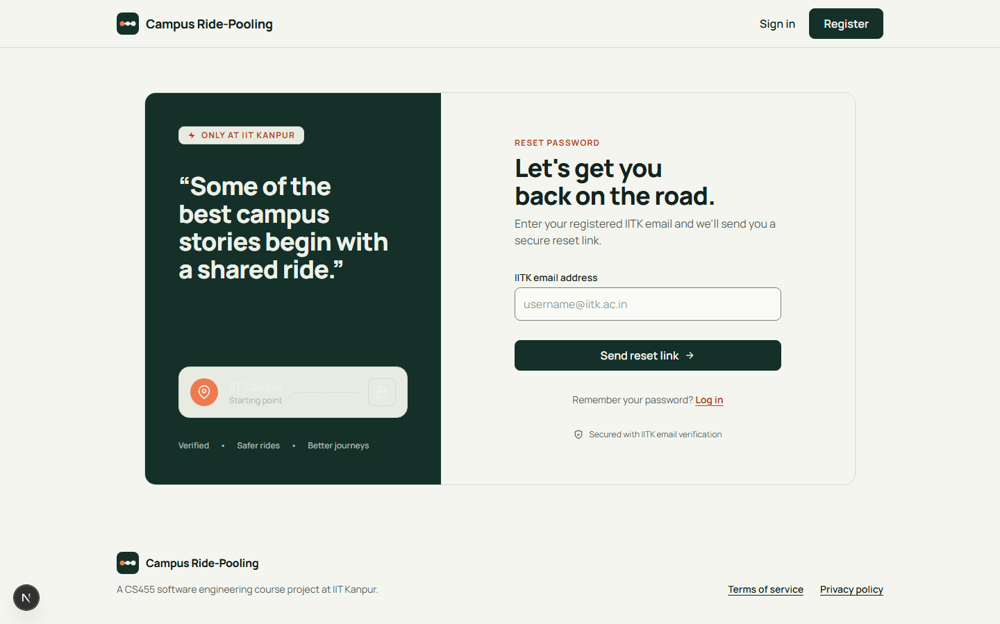
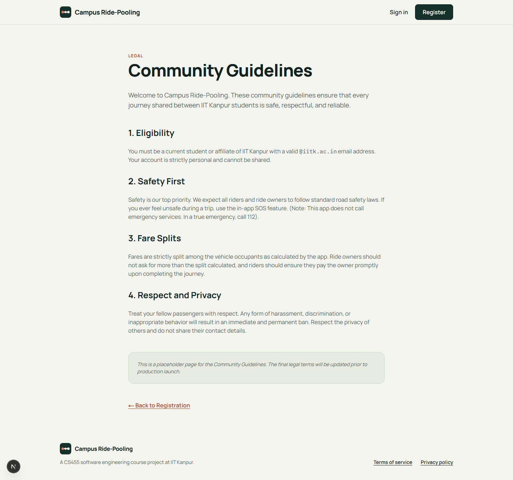
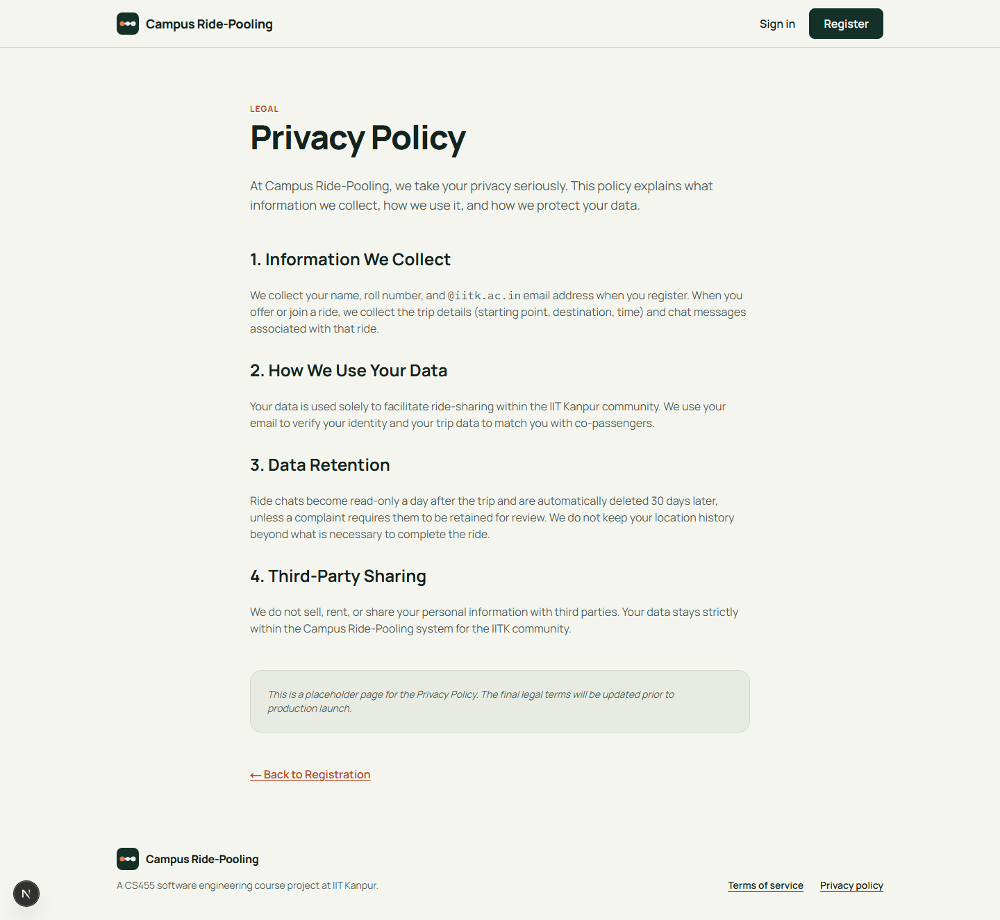
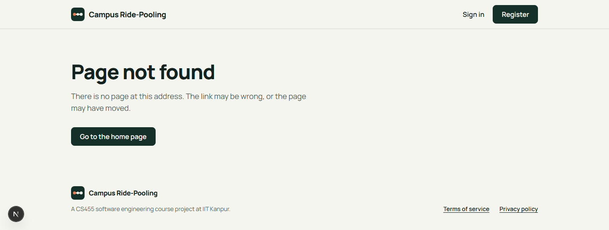
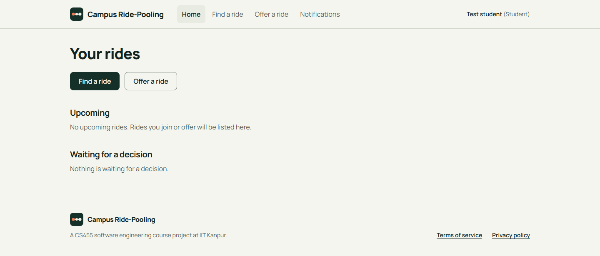
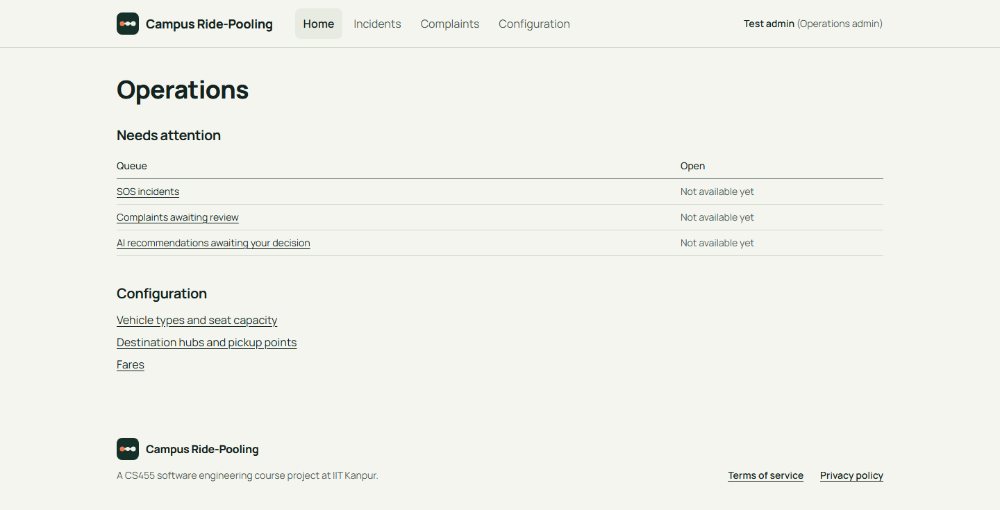

# D2 user interface screenshots

Screenshots of every page of the web app (`apps/web`) on `master`, taken on 3 October 2026 from the development server.
Each page is shown at desktop width (1440 px) in the light and dark colour schemes, and at phone width (360 px).

Signed-in views use the development session (`DEV_SESSION_ROLE=student` or `admin`), since sign-in is not yet connected to a backend. The round "N" button in a bottom corner is the Next.js development badge and does not appear in production.

| # | Page | Route | Desktop, light | Desktop, dark | Phone |
|---|---|---|---|---|---|
| 01 | Landing page | `/` | [view](01-landing-light.png) | [view](01-landing-dark.png) | [view](01-landing-phone.png) |
| 02 | Sign in | `/login` | [view](02-login-light.png) | [view](02-login-dark.png) | [view](02-login-phone.png) |
| 03 | Registration | `/register` | [view](03-register-light.png) | [view](03-register-dark.png) | [view](03-register-phone.png) |
| 04 | Reset password | `/reset-password` | [view](04-reset-password-light.png) | [view](04-reset-password-dark.png) | [view](04-reset-password-phone.png) |
| 05 | Community guidelines | `/terms` | [view](05-terms-light.png) | [view](05-terms-dark.png) | [view](05-terms-phone.png) |
| 06 | Privacy policy | `/privacy` | [view](06-privacy-light.png) | [view](06-privacy-dark.png) | [view](06-privacy-phone.png) |
| 07 | Page not found | any unknown address | [view](07-page-not-found-light.png) | [view](07-page-not-found-dark.png) | [view](07-page-not-found-phone.png) |
| 08 | Home, student | `/home` | [view](08-home-student-light.png) | [view](08-home-student-dark.png) | [view](08-home-student-phone.png) |
| 09 | Home, operations admin | `/home` | [view](09-home-admin-light.png) | [view](09-home-admin-dark.png) | [view](09-home-admin-phone.png) |

## Landing page (`/`)

## Sign in (`/login`)

## Registration (`/register`)

## Reset password (`/reset-password`)

## Community guidelines (`/terms`)

## Privacy policy (`/privacy`)

## Page not found (any unknown address)

## Home, student (`/home`)

## Home, operations admin (`/home`)

